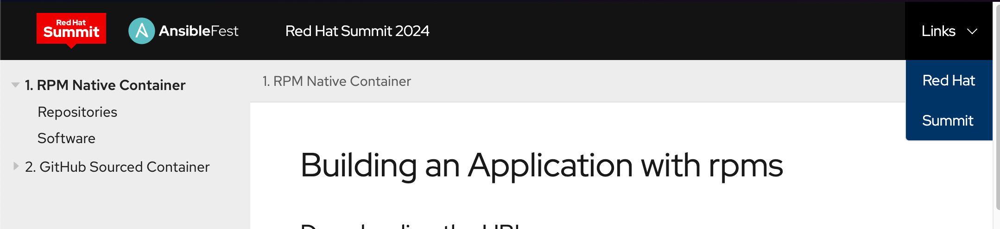
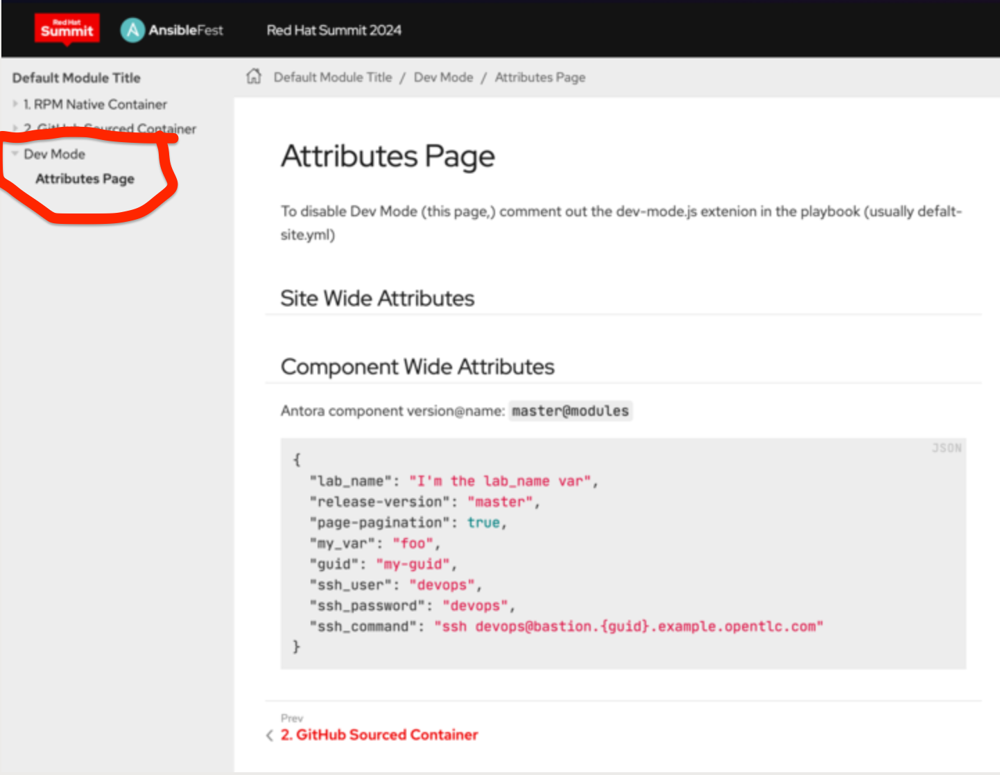

== Welcome to the Red Hat Summit 2024 Showroom Template

This git repo template was created to make it easy for you to start developing your lab instructions.

Features:

. 0% cruft
. Red Hat Summit 2024 UI bundle
. Dev Mode extension that displays the asciidoc attributes you have to work with
. Content is generated using Antora, a static site generator for creating documentation sites from AsciiDoc documents.

== Getting Started

=== Using Containers (Recommended)

In order to test and develop on your local machine, you can use a specially built container with Podman or Docker as follows.

. Create a git repo from this template
.. Suggested naming: `showroom_<lab-name>`
. Clone your new repo and `cd` into it
. When you make changes to the content, all you need is to kill the container and run it again.
+
[source,sh]
----
podman run --rm --name antora -v $PWD:/antora -p 8080:8080 -i -t ghcr.io/juliaaano/antora-viewer
----

Live-reload is not supported.

=== Using Local Files (Less Recommended)

. Create a git repo from this template
. Clone the repo and `cd` into it
. Run ./utilities/lab-serve
. Open http://localhost:8080 in your browser
. Run ./utilities/lab-build to build your html

To rebuild your html, run `./utilites/build`.

== Editing Files

Now you are ready to go!
You can start editing the files in the `content/modules/ROOT/pages/` directory.

Many modern editors such as Visual Studio Code offer live Asciidoc Preview extensions.

=== Understanding the Basic Template Directory Structure

[source,sh]
----
./content/modules/ROOT/
├── assets
│   └── images                       # Images used in your content
│       └── example-image.png
├── examples                         # You can add downloadable assets here
│   └── example-bash-script.sh       # e.g. an example bash script
├── nav.adoc                         # Navigation for your lab
├── pages                            # Your content goes here
│   ├── index.adoc                   # First page of your lab, e.g. overview etc
│   ├── module-01.adoc
│   └── module-02.adoc               # Sample lab has 2 modules including index.adoc
└── partials                         # You can add partials here, reusable content inserted inline into your modules
    └── example_partial.adoc
----

== Adding Additional Links

You can add links to external content in the convenient "Links" drop-down on the upper-right of the Showroom Summit 2024 UI.

../content/antora.yml
[source,yaml]
----
asciidoc:
  attributes:
    page-links:
    - url: https://redhat.com
      text: Red Hat
    - url: https://www.redhat.com/en/summit
      text: Summit
----

== Dev Mode

As a convenience to developers, the Dev Mode Extention (disabled by default) displays the asciidoc attributes you have to work with while writing your lab instructions.

. Disable/Enable Dev Mode by changing `enabled: true` or `enabled: false`
+
.default-site.yml
[source,yaml]
----
extensions:
  - id: dev-mode
    require: ./content/lib/dev-mode.js
    enabled: false
----

. Produces
+

